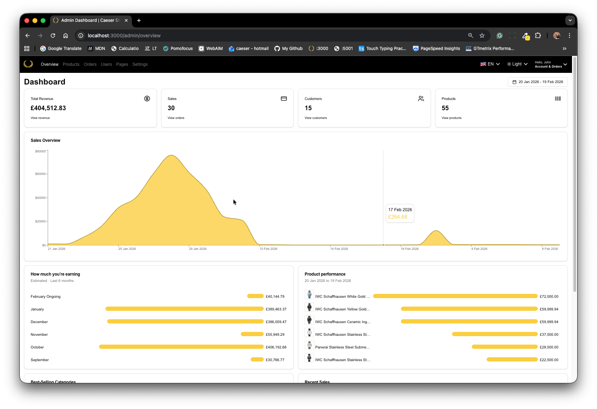

# 🛍️ Caeser Store

A full-featured e-commerce platform built with Next.js 15 and MongoDB, inspired by Amazon's shopping experience. Browse products, manage inventory, process payments, and keep customers informed—all in one modern web application.

**Live:** [caeser-store.vercel.app](https://caeser-store.vercel.app/)

|                  Store                   |                  Admin                   |
| :--------------------------------------: | :--------------------------------------: |
|  |  |

- **Product catalog** — Categories including Shirts, Jeans, Shoes, Wrist Watches, Sunglasses, and Cufflinks
- **Search & filters** — Find products by name, category, tag, price range, and rating
- **Product details** — Images, reviews, ratings, sizes, colors, and stock availability
- **Shopping cart** — Add items, adjust quantities, and choose delivery options
- **Browsing history** — Track recently viewed products and related recommendations

### Payments

- **Stripe** — Credit and debit card payments with secure checkout
- **PayPal** — One-click PayPal checkout
- **Cash on Delivery** — Pay when your order arrives

### Internationalization

- **Multi-language** — English (en-GB), Arabic (ar), and French (fr) with RTL support
- **Multi-currency** — GBP, USD, EUR, AED with configurable conversion rates

### Inventory & Stock

- **Real-time stock tracking** — Product quantities update automatically when orders are placed
- **Low-stock awareness** — `countInStock` prevents overselling and keeps inventory accurate
- **Admin product management** — Create, edit, and manage products with full control over stock levels

### Email Notifications

- **Purchase receipt** — Customers receive an order confirmation email after payment
- **Review reminders** — Customers get a follow-up email (scheduled 1 day after delivery) to review their purchases
- **Resend** — Professional transactional emails powered by Resend

### Admin Dashboard

- **Orders** — View, track, and manage all customer orders
- **Products** — Add products, upload images (UploadThing), set prices, and manage stock
- **Users** — Manage user accounts and roles (Admin/User)
- **Settings** — Configure site info, carousels, languages, currencies, payment methods, and delivery options
- **Analytics** — Sales overview with charts (Recharts)
- **Web pages** — Manage About, Contact, and Help content

### Authentication

- **Auth.js** — Sign in with credentials, Google OAuth, or Magic Link
- **Role-based access** — Admin and User roles with protected routes

### ▶️ Try the Demo (Test Accounts)

> ℹ️ All accounts use **test mode** — no real payments are processed. Demo data resets nightly.

| Role        | Email               | Password     |
| ----------- | ------------------- | ------------ |
| 👤 Customer | `user@example.com`  | `User@1234`  |
| 👨‍💼 Admin    | `admin@example.com` | `Admin@1234` |

#### Quick Start:

- **As a customer**: Log in with credentials above or sign up instantly using **Google OAuth**
- **As admin**: Log in → visit `/admin` to access the dashboard (inventory, orders, analytics)

### 💳 Test Payment Options

#### **Option 1: Stripe Credit Card** (Direct Entry)

| Field               | Value                             |
| ------------------- | --------------------------------- |
| **Card Number**     | `4111 1111 1111 1111`             |
| **Expiry Date**     | Any future date (e.g., `12 / 30`) |
| **CVC**             | Any 3 digits (e.g., `123`)        |
| **ZIP/Postal Code** | `SW1A 1AA`                        |

#### **Option 2: PayPal** (Sandbox Login Required)

1. At checkout, click **"Pay with PayPal"**
2. Log in with Sandbox credentials:
   - **Email**: `buyer+uk@personal.example.com`
   - **Password**: `PayPal@Demo123` _(see security note below)_
3. On PayPal's payment screen, select:
   - ✅ **PayPal balance** (£10,000 available), OR
   - ✅ **Saved test card**: Visa ending in `9695` (expires 03/2031)
4. Click **"Pay Now"** → You'll return to order confirmation

> 🔒 All transactions occur in PayPal's sandbox environment. No real money is charged or transferred.

---

### 🔒 Security Transparency

> _Demo credentials and payment details are published here for recruiter convenience. In production deployments:_
>
> - ✅ Credentials would be environment-specific (`.env`)
> - ✅ Admin routes would require RBAC + session validation
> - ✅ Passwords would enforce complexity rules
> - ✅ Payment processing would use live API keys (never committed to Git)
> - ✅ Seed scripts would run only in development environments

_This demo uses isolated test data with no connection to real payment systems or customer information._

## Tech Stack

| Layer       | Technology                        |
| ----------- | --------------------------------- |
| Framework   | Next.js 15, React 19              |
| UI          | Tailwind CSS, shadcn/ui, Recharts |
| Database    | MongoDB, Mongoose                 |
| Payments    | Stripe, PayPal                    |
| Email       | Resend, React Email               |
| Auth        | Auth.js (NextAuth v5)             |
| File upload | UploadThing                       |
| Deployment  | Vercel, GitHub                    |

## Getting Started

### Prerequisites

- Node.js 18+
- MongoDB (local or Atlas)
- Stripe account
- PayPal developer account
- Resend account (for emails)
- UploadThing account (for product images)

### Installation

```bash
# Clone the repository
git clone <repository-url>
cd caeser-clothing-store

# Install dependencies
pnpm install

# Copy environment variables
cp .env.example .env

# Seed the database (optional)
pnpm run seed

# Start development server
pnpm dev
```

### Environment Variables

Create a `.env` file with:

```
MONGODB_URI=          # MongoDB connection string
NEXTAUTH_SECRET=      # Auth.js secret
NEXTAUTH_URL=         # App URL (e.g. http://localhost:3000)
STRIPE_SECRET_KEY=    # Stripe secret key
STRIPE_WEBHOOK_SECRET=# Stripe webhook signing secret
NEXT_PUBLIC_STRIPE_PUBLISHABLE_KEY=
PAYPAL_CLIENT_ID=     # PayPal client ID
PAYPAL_CLIENT_SECRET= # PayPal client secret
RESEND_API_KEY=       # Resend API key for emails
UPLOADTHING_TOKEN=    # UploadThing token for file uploads
```

### Default Admin

- **Email:** admin@example.com
- **Password:** 123456

## Project Structure

```
app/
├── [locale]/           # Internationalized routes
│   ├── (home)/         # Home page
│   ├── (root)/         # Main app (search, cart, account, product)
│   ├── admin/          # Admin dashboard
│   ├── checkout/       # Checkout flow
│   └── (auth)/         # Sign in, sign up
lib/
├── actions/            # Server actions (orders, products, settings)
├── db/                 # MongoDB models and connection
├── paypal/             # PayPal integration
└── validator/          # Zod schemas
emails/                 # React Email templates
components/             # Shared UI components
```

## Scripts

| Command      | Description                    |
| ------------ | ------------------------------ |
| `pnpm dev`   | Start development server       |
| `pnpm build` | Build for production           |
| `pnpm start` | Start production server        |
| `pnpm seed`  | Seed database with sample data |
| `pnpm lint`  | Run ESLint                     |

## License

This project is licensed under the MIT License – see the LICENSE file for details.
