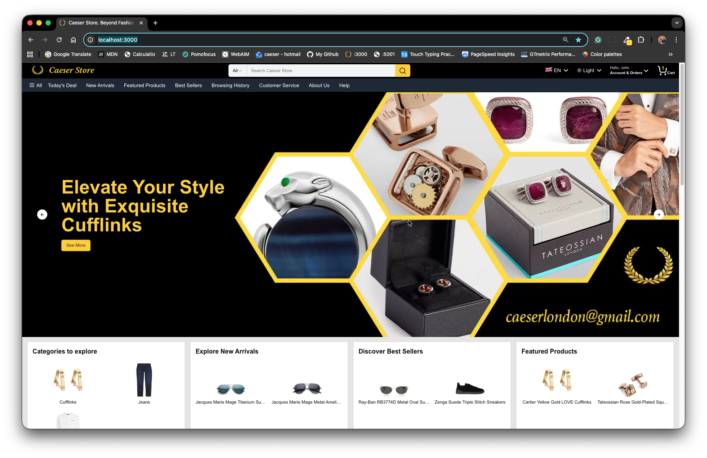
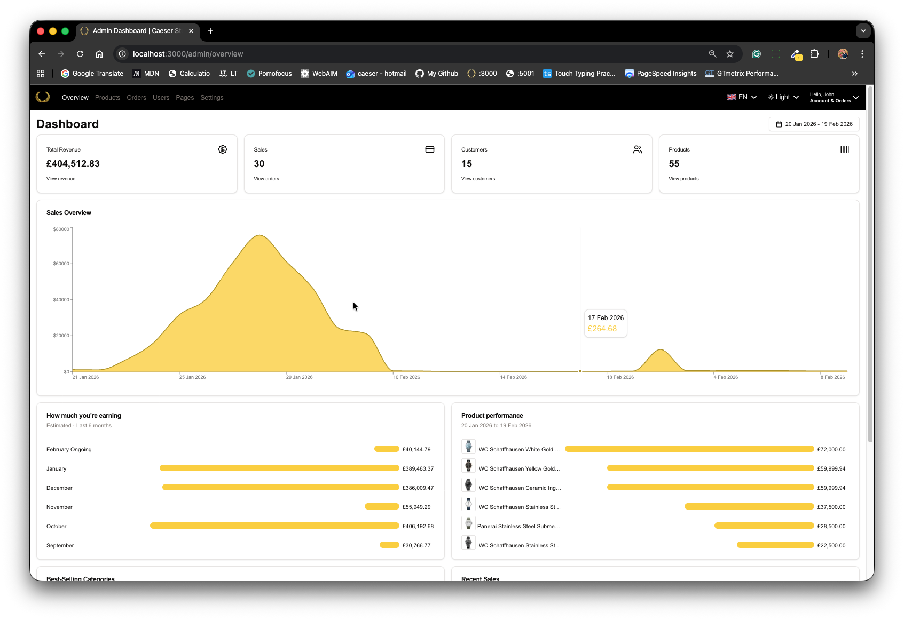

# 🛍️ Caeser Store

A modern full-featured e-commerce platform built with **Next.js 15**, **MongoDB**, and **TypeScript**, inspired by Amazon’s shopping experience. Customers can browse products, place orders, and pay securely, while admins can manage inventory, users, content, and store settings from a dedicated dashboard.

**Live Demo:** [caeser-store.vercel.app](https://caeser-store.vercel.app/)

|                  Store                   |                  Admin                   |
| :--------------------------------------: | :--------------------------------------: |
|  |  |

## Features

- **Product catalogue** — Browse categories including Shirts, Jeans, Shoes, Wrist Watches, Sunglasses, and Cufflinks
- **Search and filters** — Find products by name, category, tag, price range, and rating
- **Product details** — View images, reviews, ratings, sizes, colours, and stock availability
- **Shopping cart** — Add items, update quantities, and choose delivery options
- **Browsing history** — See recently viewed products and related recommendations

## Payments

- **Stripe** — Secure credit and debit card payments
- **PayPal** — Fast PayPal checkout
- **Cash on Delivery** — Pay when your order arrives

## Internationalisation

- **Multi-language** — English (en-GB), Arabic (ar), French (fr), German (de-DE), Italian (it-IT), Spanish (es-ES), and Portuguese (pt-PT), with RTL support
- **Multi-currency** — GBP, USD, EUR, and AED with configurable conversion rates

## Inventory and Stock

- **Real-time stock tracking** — Quantities update automatically when orders are placed
- **Low-stock protection** — `countInStock` helps prevent overselling
- **Admin product management** — Create, edit, and manage products with full control over pricing and stock levels

## Email Notifications

- **Order confirmation** — Customers receive a purchase receipt after payment
- **Review reminders** — Follow-up emails are scheduled 1 day after delivery
- **Resend integration** — Transactional emails powered by Resend and React Email

## Admin Dashboard

- **Orders** — View, track, and manage customer orders
- **Products** — Add products, upload images with UploadThing, set prices, and manage stock
- **Users** — Manage accounts and roles (Admin/User)
- **Settings** — Configure site details, carousels, languages, currencies, payment methods, and delivery options
- **Analytics** — View sales insights with charts powered by Recharts
- **Pages** — Manage About, Contact, and Help content

## Authentication

- **Auth.js** — Sign in with credentials, Google OAuth, or Magic Link
- **Role-based access control** — Protected routes for Admin and User roles

## ▶️ Try the Demo

> ℹ️ All accounts run in **test mode**. No real payments are processed, and demo data may be reset periodically.

| Role        | Email               | Password     |
| ----------- | ------------------- | ------------ |
| 👤 Customer | `user@example.com`  | `User@1234`  |
| 👨‍💼 Admin    | `admin@example.com` | `Admin@1234` |

### Quick start

- **Customer** — Sign in with the demo account above or use **Google OAuth**
- **Admin** — Sign in and visit `/admin` to access the dashboard

## 💳 Test Payment Options

### Option 1: Stripe Credit Card

| Field               | Value                                   |
| ------------------- | --------------------------------------- |
| **Card Number**     | `4111 1111 1111 1111`                   |
| **Expiry Date**     | Any future date (for example `12 / 30`) |
| **CVC**             | Any 3 digits (for example `123`)        |
| **ZIP/Postal Code** | `SW1A 1AA`                              |

### Option 2: PayPal Sandbox

1. At checkout, click **Pay with PayPal**
2. Sign in with the sandbox account:
   - **Email:** `buyer+uk@personal.example.com`
   - **Password:** `PayPal@Demo123`
3. On the PayPal screen, choose either:
   - **PayPal balance** (£10,000 available), or
   - **Saved test card** ending in `9695` (expires `03/2031`)
4. Click **Pay Now** to complete the order

> 🔒 All PayPal transactions run inside the sandbox environment. No real money is charged or transferred.

---

## 🔒 Security Transparency

> Demo credentials and test payment details are included for recruiter and reviewer convenience. In a production deployment:

- Credentials would be environment-specific
- Admin routes would require full RBAC and session validation
- Passwords would enforce stronger security policies
- Payment processing would use live API keys stored securely in environment variables
- Seed scripts would only run in development environments

This demo uses isolated test data and is not connected to any live customer or payment information.

## Tech Stack

| Layer       | Technology                        |
| ----------- | --------------------------------- |
| Framework   | Next.js 15, React 19              |
| Language    | TypeScript                        |
| UI          | Tailwind CSS, shadcn/ui, Recharts |
| Database    | MongoDB, Mongoose                 |
| Payments    | Stripe, PayPal                    |
| Email       | Resend, React Email               |
| Auth        | Auth.js (NextAuth v5)             |
| File Upload | UploadThing                       |
| Deployment  | Vercel, GitHub                    |

### LICENSE

- This project is licensed under the MIT License – see the LICENSE file for details.
